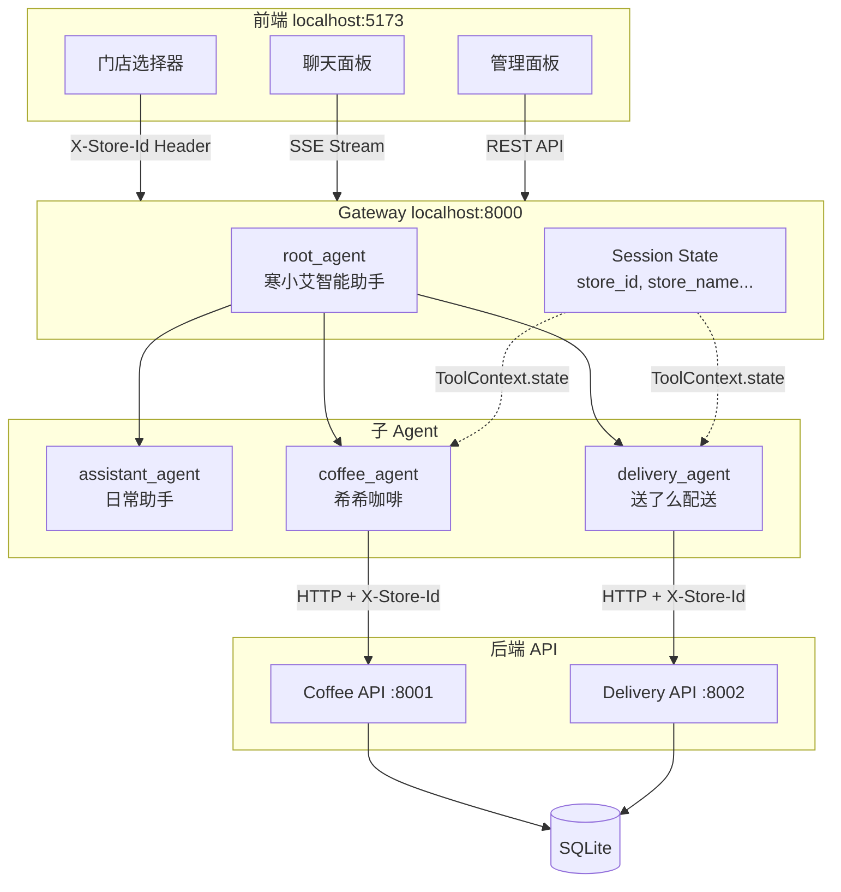
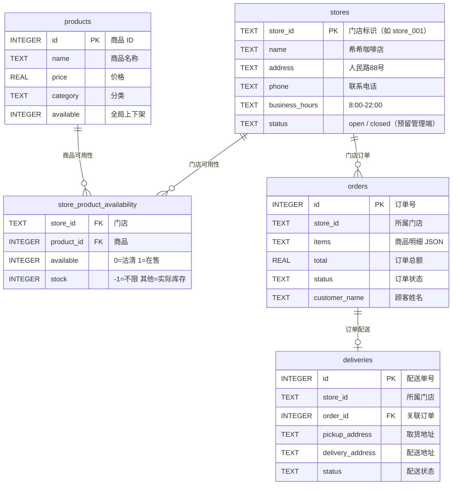
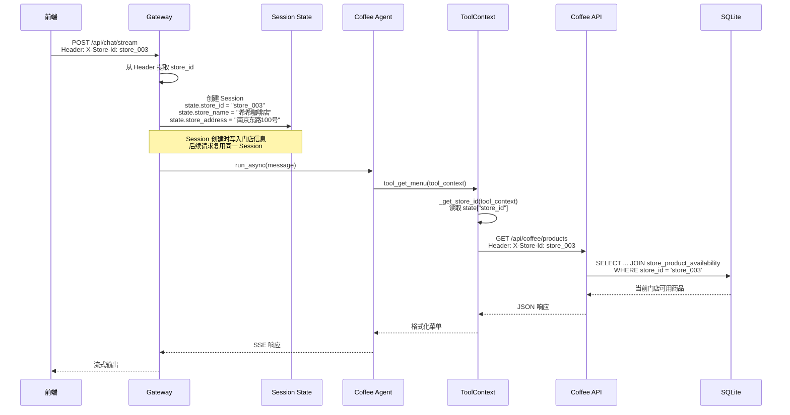
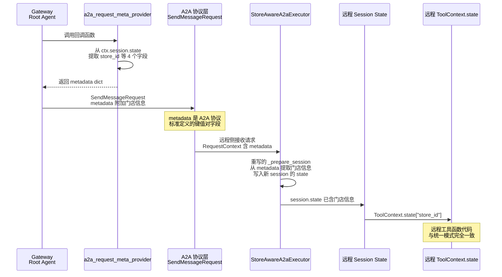

# Buy A Coffee -- 多门店 Session State Demo

## 1. 项目简介

**Buy A Coffee** 是一个基于 [Google ADK (Agent Development Kit)](https://github.com/google/adk-python) 和 [A2A (Agent-to-Agent) 协议](https://github.com/a2aproject/A2A) 构建的多 Agent 智能咖啡订购系统。

在 AI Agent 应用中，一个常见但容易被低估的问题是：**如何在多个 Agent 之间可靠地传递业务上下文**（比如"当前用户在哪家门店"）。很多实现依赖于将参数硬编码在提示词中让 LLM 传递，这种方式不稳定且难以调试。本项目通过一个完整的「选门店 → 点咖啡 → 查订单 → 叫配送」业务流程，展示如何利用 ADK 的 **Session State** 机制和 A2A 协议的 **metadata** 字段，实现结构化、可靠、可调试的跨 Agent 参数传递。

### 本项目演示的核心能力

- **多门店架构** -- 同一套 Agent 系统服务多个门店，通过 `store_id` 实现数据隔离，无需为每个门店部署独立系统
- **Session State 驱动的参数传递** -- 业务上下文（门店信息）写入 Session State 后，所有 Agent 的工具函数自动感知，不依赖 LLM 提示词传递参数
- **A2A 跨进程 State 桥接** -- 当 Agent 分布式部署在不同进程时，通过 A2A 协议标准的 `metadata` 机制将 Session State 桥接到远程 Agent，保持工具函数代码零差异
- **多 Agent 协作** -- Root Agent 根据用户意图，自动路由到日常助手、咖啡服务、配送服务三个专业 Agent

### 技术栈

| 层级 | 技术 | 用途 |
|------|------|------|
| AI 框架 | Google ADK v1.x | Agent 定义、工具绑定、Session State 管理 |
| Agent 通信 | A2A SDK | 分布式部署时 Agent 间通信 |
| 后端 | FastAPI + SQLite (aiosqlite) | REST API、异步数据持久化 |
| 前端 | React + TypeScript + TailwindCSS | 用户界面、门店选择器 |
| LLM | 通义千问 / Gemini（可切换） | 自然语言理解与生成 |

---

## 2. 背景知识

> 如果你已经熟悉 ADK 的 Session、State、ToolContext 等概念，可以跳过本节。

### 2.1 什么是 AI Agent

AI Agent 是一个能够自主决策和执行任务的 AI 系统。与普通的聊天机器人不同，Agent 可以：
- **使用工具** -- 调用 API、查询数据库、发送消息等
- **多步推理** -- 将复杂任务分解为多个步骤依次执行
- **协作** -- 将任务委派给其他专业 Agent 处理

在本项目中，`root_agent` 接收用户消息后，根据意图将请求路由给 `coffee_agent`（处理点单）或 `delivery_agent`（处理配送），每个 Agent 拥有各自的工具函数。

### 2.2 什么是 Session 和 Session State

在 ADK 中，**Session** 代表一次对话会话，包含用户和 Agent 之间的所有消息历史。每个 Session 有一个唯一的 `session_id`。

**Session State** 是挂载在 Session 上的键值对存储（类似于 Web 开发中的 Session Storage），用于在同一会话的多次交互中保持上下文。ADK 中的 State 有三个作用域前缀：

| 前缀 | 作用域 | 示例 |
|------|--------|------|
| 无前缀 | App 级别，所有 Agent 共享 | `state["store_id"]` |
| `temp:` | 单次调用内有效 | `state["temp:intermediate_result"]` |
| `<agent_name>:` | 特定 Agent 私有 | `state["coffee_agent:last_order"]` |

本项目使用无前缀的 App 级 State 存储门店信息，确保 `root_agent`、`coffee_agent`、`delivery_agent` 都能访问。

### 2.3 什么是 ToolContext

当 ADK Agent 调用工具函数时，框架会自动注入一个 `ToolContext` 对象。工具函数通过声明 `*, tool_context: ToolContext` 参数来接收它。`ToolContext` 提供了对当前 Session State 的读写能力：

```python
def my_tool(param: str, *, tool_context: ToolContext) -> dict:
    store_id = tool_context.state.get("store_id")  # 读取 state
    tool_context.state["last_query"] = param        # 写入 state
    return {"result": "..."}
```

这是本项目中工具函数获取门店信息的核心机制 -- 不通过 LLM 参数传递，而是直接从 State 读取。

### 2.4 什么是 A2A 协议

[A2A (Agent-to-Agent)](https://a2a-protocol.org/) 是一个开放协议，用于不同框架、不同进程甚至不同组织的 Agent 之间通信。核心概念包括：

- **Agent Card** -- Agent 的自描述文档（类似 OpenAPI spec），声明能力和通信端点
- **SendMessageRequest** -- 向远程 Agent 发送消息的请求，包含 `message`（消息内容）和 `metadata`（附加上下文）
- **Task** -- 远程 Agent 处理请求的工作单元，有状态生命周期（submitted → working → completed）

ADK 通过 `RemoteA2aAgent` 类封装了 A2A 客户端，使远程 Agent 的使用方式与本地子 Agent 一致。

### 2.5 传参方式对比：为什么选择 Session State

在多 Agent 系统中传递业务上下文（如 `store_id`）有多种方式，各有优劣：

| 方式 | 原理 | 可靠性 | 可调试性 | 代码侵入 |
|------|------|--------|----------|----------|
| 提示词注入 | 在 instruction 中写入参数，靠 LLM 在委派时传递 | 低 -- LLM 可能遗忘或篡改 | 低 -- 难以追踪 | 低 |
| 工具显式参数 | 每个工具函数增加 `store_id` 参数，LLM 填入 | 中 -- 依赖 LLM 正确填参 | 中 | 高 -- 所有工具签名都要改 |
| **Session State** | 写入 State 后工具函数直接读取，不经过 LLM | **高** -- 结构化数据，不依赖 LLM | **高** -- 可日志追踪 | **低** -- 工具函数通过 ToolContext 读取 |

本项目采用 Session State 方案，并通过 A2A 的 `metadata` 机制将其扩展到分布式部署场景。

---

## 3. 架构总览

### 3.1 系统架构



**各层职责**：

- **前端**：提供门店选择器和聊天界面。用户选择门店后，所有请求自动携带 `X-Store-Id` HTTP Header。
- **Gateway**：接收用户请求，从 Header 中提取 `store_id`，创建带有门店信息的 Session，然后将消息交给 Root Agent 处理。
- **Root Agent**：根据用户意图路由到合适的子 Agent。它的 instruction 是动态生成的，会从 Session State 中读取当前门店信息并注入提示词。
- **子 Agent**：各自负责一个业务领域（咖啡点单、配送、日常助手）。工具函数通过 `ToolContext.state` 获取 `store_id`，无需显式参数传递。
- **后端 API**：独立的 REST API 服务，通过 `X-Store-Id` Header 实现多租户数据隔离。
- **数据库**：所有门店共用同一个 SQLite 数据库，通过 `store_id` 字段区分不同门店的数据。

### 3.2 部署模式

本项目支持两种部署模式，核心差异在于 Agent 之间的通信方式和 Session State 的传递机制：

| 维度 | 统一部署（默认） | 分布式部署 |
|------|-----------------|-----------|
| 进程数 | 3（Coffee API + Delivery API + Gateway） | 5（+ Coffee A2A + Delivery A2A） |
| Agent 通信 | 进程内直接调用，共享内存 | A2A 协议（JSON-RPC over HTTP） |
| Session State 传递 | 天然共享同一 `SessionService` 实例 | 通过 `metadata` 机制桥接（详见第 4.2 节） |
| 启动命令 | `make dev` | 需配置 `DEPLOY_MODE=distributed` |
| 适用场景 | 本地开发、功能演示 | 生产环境、独立扩缩容 |

统一部署模式下 Session State 传递是"免费"的（进程内共享内存），本文档重点说明的是**分布式部署模式下如何解决 State 跨进程传递问题**。

---

## 4. 多门店设计

### 4.1 数据模型

为了支持多门店，数据库采用"共享菜单 + 门店可用性 + 门店订单隔离"的设计：



**设计要点**：

- **共享菜单** -- `products` 表存储全局商品信息（名称、价格、分类），所有门店共用同一套菜单。这意味着新增商品时只需操作一次，所有门店立即可见。
- **门店可用性** -- `store_product_availability` 表通过 `(store_id, product_id)` 联合唯一键控制每个门店的商品是否在售和库存。查询菜单时通过 LEFT JOIN 过滤出当前门店的可用商品。
- **订单隔离** -- `orders` 和 `deliveries` 表通过 `store_id` 字段实现门店级数据隔离。查询订单时 SQL 始终带有 `WHERE store_id = ?` 条件。
- **管理端预留** -- `stores.status` 字段（open/closed）和 `store_product_availability.stock` 字段为未来的管理端 Agent 预留，支持暂停营业、沽清商品等操作。

### 4.2 种子门店数据

系统初始化时自动创建 3 家门店，每家门店默认所有商品可用：

| store_id | 名称 | 地址 | 营业时间 |
|----------|------|------|----------|
| store_001 | 希希咖啡店 | 人民路88号 | 8:00-22:00 |
| store_002 | 希希咖啡店 | 中关村大街1号 | 7:30-21:30 |
| store_003 | 希希咖啡店 | 南京东路100号 | 8:00-23:00 |

### 4.3 store_id 全链路穿透

`store_id` 从用户选择门店到数据库查询，经过 7 层传递。以下时序图展示了完整链路：



**关键设计**：`store_id` 在进入 Session State 后就"沉淀"了，后续的每次工具调用都自动从 State 中读取，不需要 LLM 在每次工具调用时主动传递参数。这消除了 LLM 遗忘或错误传递 `store_id` 的风险。

---

## 5. Session State 参数传递

这是本 Demo 的核心亮点。本节详细说明 `store_id` 如何通过 Session State 在 Agent 间传递，以及在分布式部署时如何跨进程桥接。

### 5.1 统一部署模式下的 State 传递

在统一部署中，Gateway、Root Agent、Coffee Agent、Delivery Agent 运行在同一个 Python 进程中，共享同一个 `InMemorySessionService` 实例。这意味着所有 Agent 访问的是**同一个 Session 对象**，State 的读写天然互通。

**第一步：Gateway 创建 Session 时写入门店信息**

当用户首次发送消息时，Gateway 从 HTTP Header 中提取 `store_id`，查询门店详情，然后创建一个带有门店上下文的 Session：

```python
# gateway/main.py
session = await session_service.create_session(
    app_name=APP_NAME,
    user_id=USER_ID,
    session_id=session_id,
    state={
        "store_id": store_id,              # "store_003"
        "store_name": name,                # "希希咖啡店"
        "store_address": address,          # "南京东路100号"
        "store_display_name": display,     # "希希咖啡店（南京东路100号）"
    },
)
```

此后，同一 `session_id` 的所有请求都会复用这个 Session，门店信息持续有效。

**第二步：Root Agent 通过动态 Instruction 感知门店**

Root Agent 的 instruction 不是静态字符串，而是一个接收 `ReadonlyContext` 的函数。ADK 在每次调用前执行这个函数，从 State 中读取当前门店信息注入提示词：

```python
# gateway/agent.py
def _dynamic_instruction(context: ReadonlyContext) -> str:
    state = context.state
    store_display = state.get("store_display_name", "希希咖啡店")
    return f"""你是寒小艾智能助手系统的入口。
    **当前门店**：{store_display}
    ...（省略其他指令）"""
```

这确保了 LLM 在回复用户时始终知道当前门店。例如用户说"你好"，Agent 会回复"我们现在在希希咖啡店（南京东路100号）"。

**第三步：工具函数通过 ToolContext 读取 store_id**

当 LLM 决定调用工具（如查看菜单），ADK 自动将 `ToolContext` 注入工具函数。工具函数从中读取 `store_id`，然后传给后端 API：

```python
# coffee/agent.py
def _get_store_id(tool_context: ToolContext) -> str:
    return tool_context.state.get("store_id", "store_001")

def tool_get_menu(category: str = None, *, tool_context: ToolContext) -> dict:
    """获取当前门店的咖啡菜单"""
    return tools.get_menu(store_id=_get_store_id(tool_context), category=category)
```

注意 `store_id` 没有出现在工具函数的用户可见参数中（即 LLM 不需要传递 `store_id`），它完全由 State 驱动。这就是 State 传参的核心优势。

### 5.2 分布式部署模式下的 State 跨进程传递（A2A）

#### 问题

分布式部署中，Coffee Agent 和 Delivery Agent 运行在独立进程中（端口 8003、8004），各自拥有独立的 `InMemorySessionService`。Gateway 的 Session State 中有 `store_id`，但远程 Agent 的 Session 是在其自己的进程中新建的，**State 默认为空**。

这意味着远程 Agent 的工具函数调用 `tool_context.state.get("store_id")` 时会得到 `None`（回退到默认值 `"store_001"`），导致所有用户请求都被错误地路由到第一家门店。

#### 解决方案

通过三个组件的协作，将 Gateway 的 Session State 桥接到远程 Agent：



#### 组件 1：a2a_request_meta_provider（发送侧）

ADK 的 `RemoteA2aAgent` 提供了一个名为 `a2a_request_meta_provider` 的回调参数。这是一个官方 API，在每次向远程 Agent 发送 A2A 请求前被调用。回调函数接收当前的 `InvocationContext`（包含 Session State），返回一个 dict，该 dict 会被映射到 A2A 请求的 `metadata` 字段。

```python
# gateway/agent.py
STORE_STATE_KEYS = ("store_id", "store_name", "store_address", "store_display_name")

def _store_meta_provider(ctx: InvocationContext, msg) -> dict[str, Any]:
    """从 Gateway session state 提取门店信息，注入 A2A 请求 metadata"""
    state = ctx.session.state
    return {k: state[k] for k in STORE_STATE_KEYS if k in state}

# 创建远程 Agent 时注入回调
RemoteA2aAgent(
    name="coffee_agent",
    agent_card=COFFEE_A2A_URL,
    a2a_request_meta_provider=_store_meta_provider,
)
```

#### 组件 2：SendMessageRequest.metadata（传输层）

[A2A 协议规范](https://a2a-protocol.org/latest/specification/) 中，`SendMessageRequest` 定义了一个 `metadata` 字段：

> **metadata** (object, optional): A flexible key-value map for passing additional context or parameters.

这是 A2A 协议为上下文传递专门设计的标准机制。门店信息通过这个字段随 A2A 请求发送到远程 Agent，不依赖消息内容或提示词。

#### 组件 3：StoreAwareA2aExecutor（接收侧）

ADK 的 `A2aAgentExecutor` 负责在远程侧接收 A2A 请求并驱动 Agent 执行。它的 `_prepare_session` 方法默认创建一个 **State 为空** 的 Session。

我们通过子类化 `A2aAgentExecutor` 并重写 `_prepare_session`，在 Session 创建后从请求的 `metadata` 中提取门店信息写入 State：

```python
# shared/a2a.py
class StoreAwareA2aExecutor(A2aAgentExecutor):
    """从 A2A 请求 metadata 中提取门店信息写入远程 session state"""

    async def _prepare_session(self, context, run_request, runner):
        # 先调用父类创建/获取 Session
        session = await super()._prepare_session(context, run_request, runner)
        # 从 A2A 请求的 metadata 中读取门店信息
        metadata = getattr(context, "metadata", None)
        if metadata:
            for key in STORE_STATE_KEYS:
                # 只写入不存在的 key，避免覆盖多轮对话中已有的值
                if key in metadata and key not in session.state:
                    session.state[key] = metadata[key]
        return session
```

`key not in session.state` 这个条件确保了多轮对话的安全性：首次请求时写入门店信息，后续请求（同一对话）不会重复覆盖。

#### 设计收益

这种方案最大的优势是**工具函数代码在两种部署模式下完全一致**。无论是统一部署还是分布式部署，`coffee/agent.py` 和 `delivery/agent.py` 中的工具函数都通过同样的 `tool_context.state.get("store_id")` 获取门店信息，不需要条件分支或不同的函数签名。

### 5.3 Session State 调试日志

为了便于开发和排错，Gateway 内置了 Session State 的结构化变更日志。每次聊天交互时，日志自动输出到终端。

**会话开始时：打印完整 State 快照**

```
📋 ┌──────────────────────────────────────────────────────────
📋 │ Chat Stream Start  (session: a1b2c3d4…)
📋 ├──────────────────────────────────────────────────────────
📋 │   store_address: '南京东路100号'
📋 │   store_display_name: '希希咖啡店（南京东路100号）'
📋 │   store_id: 'store_003'
📋 │   store_name: '希希咖啡店'
📋 └──────────────────────────────────────────────────────────
```

**State 发生变更时：打印差异（新增/删除/修改）**

```
🔄 ┌──────────────────────────────────────────────────────────
🔄 │ State Changed  (session: a1b2c3d4…)
🔄 │ trigger: LlmResponse
🔄 ├──────────────────────────────────────────────────────────
🔄 │   + new_key: 'new_value'
🔄 │   ~ existing_key:
🔄 │       before: 'old_value'
🔄 │       after:  'updated_value'
🔄 └──────────────────────────────────────────────────────────
```

**会话结束时：打印最终 State 快照**，可与开始时的快照对比，观察整个对话过程中 State 的演变。

这些日志在调试"为什么 Agent 拿到了错误的门店信息"等问题时非常有用。

---

## 6. 项目结构

```
buy-a-coffee/
├── backend/
│   ├── gateway/                  # 网关服务（端口 8000）
│   │   ├── main.py               # FastAPI 入口，Session 管理，API 代理
│   │   └── agent.py              # Root Agent 定义，动态 instruction，meta provider
│   ├── coffee/                   # 咖啡服务
│   │   ├── main.py               # Coffee API 独立入口（端口 8001）
│   │   ├── a2a.py                # Coffee A2A 服务入口（端口 8003）
│   │   ├── agent.py              # Coffee Agent 定义 + 工具函数包装
│   │   ├── api.py                # REST API 路由（X-Store-Id Header 多租户）
│   │   ├── database.py           # 数据库 Schema + CRUD（含 stores 表）
│   │   └── tools.py              # 工具函数实现（HTTP 调用后端 API）
│   ├── delivery/                 # 配送服务（结构同 coffee/）
│   ├── assistant/                # 日常助手 Agent（天气、时间、提醒）
│   ├── shared/                   # 共享模块
│   │   ├── a2a.py                # A2A 应用构建 + StoreAwareA2aExecutor
│   │   ├── database.py           # 数据库基础设施
│   │   └── http_client.py        # 同步 HTTP 客户端（供工具函数调用 API）
│   └── config.py                 # 全局配置（端口、模型、数据库路径）
├── frontend/
│   └── src/
│       ├── App.tsx               # 主应用（门店选择器 + 布局）
│       └── components/           # ChatPanel, AdminPanel 等
├── data/                         # SQLite 数据库文件（运行时生成）
├── Makefile                      # 开发命令
└── DEMO.md                       # 本文档
```

---

## 7. 快速开始

### 7.1 环境准备

- **Python 3.11+** -- 推荐使用 [uv](https://github.com/astral-sh/uv) 作为包管理器
- **Node.js 18+** -- 前端构建
- **LLM API Key** -- 通义千问（`DASHSCOPE_API_KEY`）或 Google Gemini（`GOOGLE_API_KEY`），二选一

### 7.2 配置

在 `backend/` 目录下创建 `.env` 文件：

```bash
# 使用通义千问（推荐，国内访问更快）
DASHSCOPE_API_KEY=sk-your-api-key

# 或使用 Google Gemini
# GOOGLE_API_KEY=your-api-key
```

### 7.3 安装依赖并启动

```bash
# 安装前后端依赖
make setup

# 一键启动所有服务
make dev
```

启动后会运行 4 个服务：

| 服务 | 地址 | 说明 |
|------|------|------|
| Coffee API | http://localhost:8001 | 咖啡店后端 REST API |
| Delivery API | http://localhost:8002 | 配送后端 REST API |
| Gateway | http://localhost:8000 | Agent 网关（聊天入口 + API 代理） |
| Frontend | http://localhost:5173 | 用户界面 |

按 `Ctrl+C` 可一次停止所有服务。

### 7.4 体验流程

1. 打开浏览器访问 **http://localhost:5173**
2. 在页面顶部下拉菜单**选择门店**（如「希希咖啡店（南京东路100号）」）
3. 在聊天面板中与 Agent 交互：

| 你说 | Agent 做什么 |
|------|-------------|
| "有什么好喝的？" | 调用 `tool_get_menu`，返回当前门店菜单 |
| "来一杯卡布奇诺，我叫张三，电话 138xxx" | 调用 `tool_create_order`，创建订单 |
| "我的咖啡怎么样了？" | 调用 `tool_query_order`，查询订单状态 |
| "帮我配送到 xx 路" | 转交 delivery_agent，调用 `tool_create_delivery` |

4. **切换门店**，再次发送消息，观察 Agent 自动识别新门店（欢迎语中会提及新门店名称）
5. 查看**终端日志**，观察 Session State 的初始化和变更记录

---

## 8. 后续扩展

### 8.1 持久化 SessionService

当前使用 `InMemorySessionService`，服务重启后所有会话丢失。ADK 支持自定义 `SessionService` 实现（如基于 Redis、PostgreSQL 或文件系统），替换时只需修改两处实例化代码：

| 位置 | 文件 | 说明 |
|------|------|------|
| Gateway | `gateway/main.py` 第 58 行 | 主网关的 SessionService |
| A2A 服务 | `shared/a2a.py` 第 55 行 | 远程 Agent 的 SessionService |

**所有工具函数、Agent 定义、前端代码均无需改动**，这正是 State 驱动架构的优势 -- 业务逻辑与 State 存储解耦。

### 8.2 管理端 Agent

数据库层已为管理端 Agent 预留了扩展点：

| 预留能力 | 数据库支撑 | API 支撑 |
|----------|-----------|----------|
| 暂停/恢复营业 | `stores.status` 字段（open/closed） | `PUT /stores/{id}` |
| 沽清/恢复商品 | `store_product_availability` 表 | `PUT /stores/{id}/products/{id}/availability` |
| 查询经营数据 | orders 表聚合查询 | `GET /stores/{id}/stats` |

未来只需新增 `admin/agent.py` 和 `admin/tools.py`，定义管理端 Agent 并绑定上述 API 即可，无需修改现有代码。

### 8.3 生产部署注意事项

- 将 `DEPLOY_MODE` 环境变量设为 `distributed`，各服务可独立运行和扩缩容
- 配置 `A2A_URLS` 环境变量指向远程 Agent 的 Agent Card 地址
- `StoreAwareA2aExecutor` 依赖 ADK 中标记为 `@a2a_experimental` 的实验性 API，升级 ADK 版本时需验证 `_prepare_session` 方法签名是否变化
- 生产环境建议将 `InMemorySessionService` 替换为持久化实现，并配置合适的 Session 过期策略
